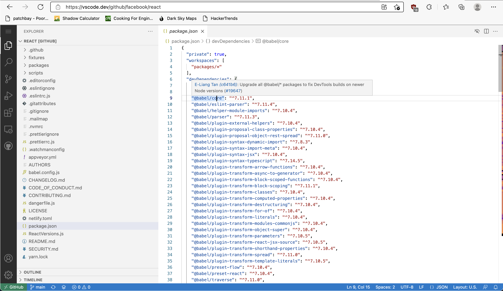

#  README

Provides a `Show Blame` command and editor action bar item. This enables blame hovers and a ruler heatmap for a given `GitHub.dev`/`vscode.dev/github` session, provided by the GitHub graphQL API.

